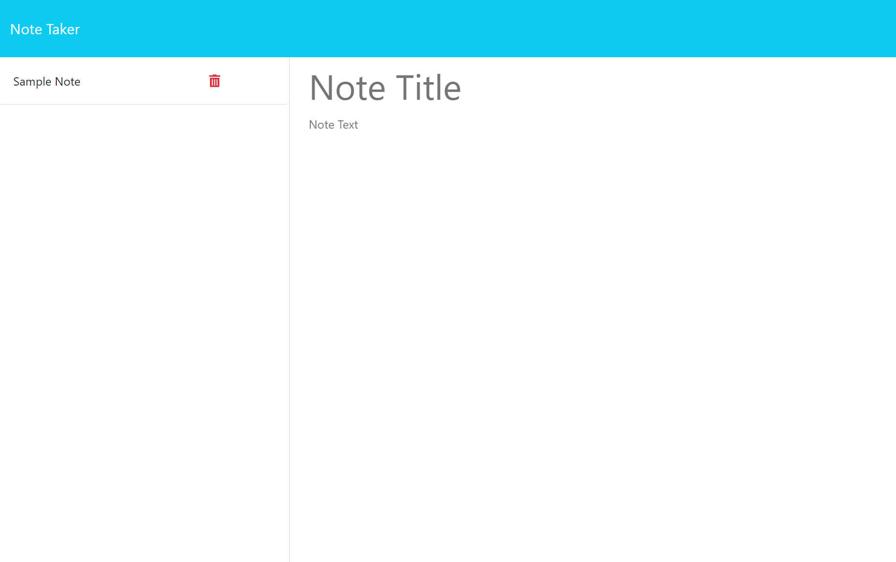

# Note Taker

## Table of Contents

• [Description](#description)  
• [Installation](#installation)  
• [Usage](#usage)  
• [License](#license)  
• [Credits](#credits)

## Description

This application was created as a homework assignment for the University of Richmond coding boot camp. The task was to create a note-taking application using an Express.js server and connect it to a pre-written front end. While working on this project, I learned about server routes and how they work and about deploying sites using Heroku.

## Installation

N/A

## Usage

Visit the website at https://damp-plateau-07752-35309968c6de.herokuapp.com/.

Click the Get Started button on the landing page to take you to the note-taking application. You will see a list of notes on the left of the screen and a space for you to write new notes on the right. Any notes on the left may be deleted by clicking on the red trash can icon next to the note title. **Note: Do not delete all notes, leaving the notes list empty, as this may cause issues with the .json file that holds the notes.** If you click on a note title from the list, the note will appear on the right for you to view. You may then click the New Note button on the top right of the screen to create a new note. Make sure you add both a title and body to your new note, and then click the Save Note button to save your note.

## License

The license that applies to this project is the MIT license. For more information about this license, please see the LICENSE file in the repo, or visit https://choosealicense.com/licenses/mit/.

## Credits

The back end of this application was coded by me. The front end was provided by the University of Richmond coding boot camp. The Node packages used are the Node.js File System module (the `fs/promises` version), the Path module, [Express.js](https://expressjs.com/), and [ShortUniqueId](https://shortunique.id/).
